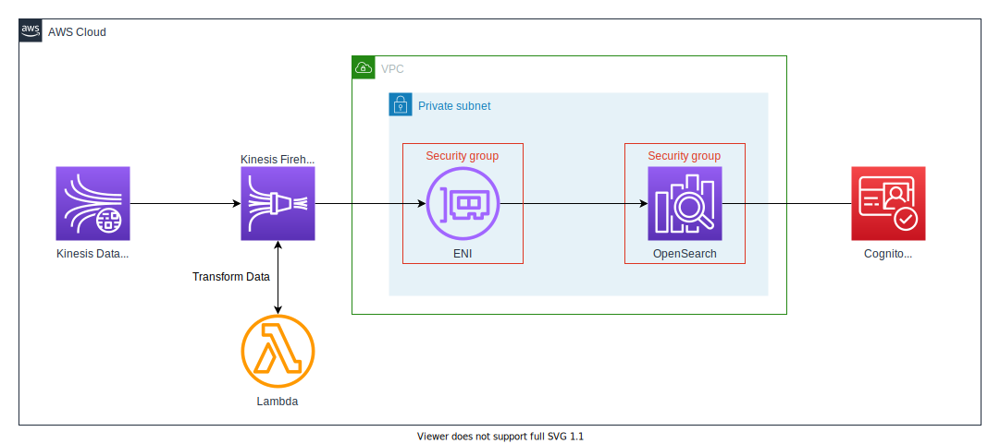

# Kinesis - Lambda - OpenSearch Stack

## Overview

This is a CDK project for streaming data analytics and visualize demonstration.



Following AWS services are deployed:
* Amazon Kinesis Data Stream
* Amazon Kinesis Data Firehose
* AWS Lambda
* Amazon OpenSearch Service
* Amazon Cognito

If you need, you can transform ingest data using Firehose transform Lambda.(See also [Appendix:Transform Ingested Data](#transform-ingested-data))

Cognito is used for OpenSearch authentication and [**fine-grained access control**](https://docs.aws.amazon.com/opensearch-service/latest/developerguide/fgac.html) is enabled.

## Limited

* OpenSearch is deployed on VPC subnet, so to access you need reachability to vpc by reverse-proxy, VPN, or Direct Connect and so on.
* OpenSearch has fine-grained access control enabled.
* This project is for demonstration purposes only, not for production environment.
* Produced apps are not included. So please prepare the input data yourself.
* Deleting the stack also deletes the CloudWatch Logs.

## Requirements

The following resources must be created in advance and the resource IDs must be set in the Context Parameter in `cdk.json` or `~/.cdk.json`. See the next section on "How to Deploy" for more information.

* VPC
* Subnet
* Security Group (for OpenSearch and Firehose)

## How to Deploy

### 1. Create Requirement Resources

* VPC
* Subnet
* Security Group (for OpenSearch and Firehose)

Of course, existing resources are also acceptable.

### 2. Configure for Context Parameters

Configure `cdk.json` or `~/.cdk.json` like following:

```json
    context: {
        "kinesis-lambda-opensearch-stack": {
            "projectName": "demo-project",
            "vpcId": "vpc-0123456789",
            "openSearchDomainName": "domainName",
            "openSearchIndexName": "indexName",
            "securityGroupIdsForOpenSearch": [
                "sg-123456789abcdef01"
            ],
            "subnets": [
                {"subnetId": "subnet-0123456789abcdef0", "availabilityZone": "us-east-1a"}
            ],
            "bucketNameForFirehose": "bucketName",
            "securityGroupIdsForFirehose": [
                "sg-123456789abcdef01"
            ]
        }
    }
```

### 3. Deploy

`cdk deploy --all`

Please wait to complete deployment. It will probably take more than 30 minutes.

### 4. Create User in Cognito User Pool

Access the Cognito User Pool on the management console and create a master user.

### 5. Add the User to the Group.

Add the user to the Cognito User Pool Group named `master`, since the group has already been created with Master-User Role assigned.

### 6. Access to OpenSearch Dashboard

With the user you created, you can now log in to your OpenSearch dashboard and access it!

## Next action after deployment

Confirm that data submitted to Kinesis is stored in OpenSearch.

### 1. Put Record to Kinesis Data Stream

```
aws kinesis put-record \
  --stream-name ${STREAM_NAME} \
  --partition-key 1
  --data `echo -n '{"key":"message"}' | base64`
```

### 2. Check Stored Data Using OpenSearch's Dev Tools

Confirm indices

```
GET /_cat/indices?v&s=index
```

Query index

```
GET /<INDEX_NAME>/_search
{
  "query": {
    "match_all": {}
  }
}
```

## How to Clean Up

You can clean Up by following command:

```
cdk destroy --all
```

## Appendix

### Transform Ingested Data

If you want to transform ingested data, you can use transform Lambda function. The function has already deployed. The source code is [lambda/transform/app.py](lambda/transform/app.py).

You modify the function code, then to deploy `cdk deploy KinesisOpenSearch-TransformLambdaStack`

## License

MIT